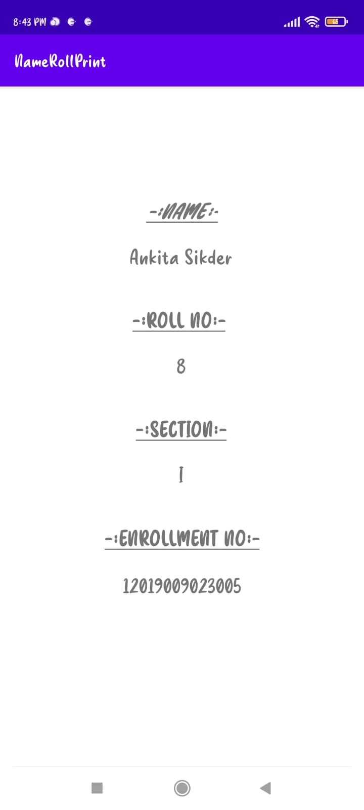

# PrintingNameRollApp

***This 'Printing Name Roll Android App' using Java is created by Ankita Sikder, student of BTECH, in University of Engineering and Management, Kolkata.***

**Email Id: ankita.sikder14@gmail.com.** 

<p align="left">
<a href="https://facebook.com/ankita.sikder.104" target="blank"></a>
<a href="https://instagram.com/ankita.sikder14" target="blank"></a>
<a href="https://github.com/ankitasikder" target="blank"></a>
</p>

[](https://shields.io/) [](https://shields.io/) [](https://shields.io/) [](https://shields.io/) [](https://shields.io/)  

## About :point_down: 

<div align="justified">

This is an android app which takes name, roll no., section, enrolment no. from user and prints them in another page. I have made this using java. I have created two java files for two actvities and two xml files to design them. It is a basic app for practicing the basic of android development.
      
</div>

## Folder Structure :point_down:
```bash
PrintingNameRollApp
      └── app
           └── src
                └── main
                      ├── AndroidManifest.xml
                      └── java/com/example/printingnamerollapp
                                     ├── MainActivity.java
                                     └── MainActivity2.java 
 ```             
## Screenshots of this app :point_down: 

<div align="center">
 
<a href="pics/n1.jpeg"></a> <a href="pics/n2.jpeg"></a> <a href="pics/n3.jpeg"></a>


</div>

         


